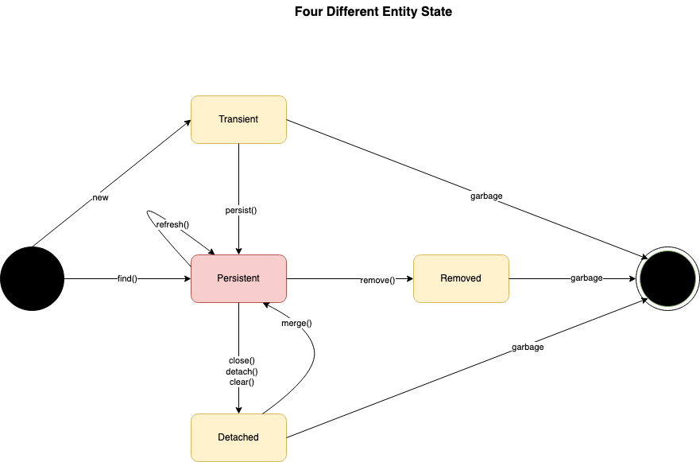

# Java

- [Jakarta EE](https://jakarta.ee)
    - [Jakarta EE 9](https://jakarta.ee/release/9/)
    - [Jakarta EE 10](https://jakarta.ee/release/10/)
- [JSP](https://jcp.org/en/home/index)
- [Google Java Style Guide](https://google.github.io/styleguide/javaguide.html)

## JDK

- [Adoptium](https://adoptium.net)
- [Amazon Corretto](https://aws.amazon.com/tw/corretto/)
- [Microsoft Build of OpenJDK](https://www.microsoft.com/openjdk)
- [OpenJDK](https://openjdk.org/)
    - [Module System Quick-Start Guide](https://openjdk.org/projects/jigsaw/quick-start)
- [Oracle Java](https://www.oracle.com/java/)
    - [Download Java](https://www.oracle.com/my/java/technologies/downloads/)

## Java Documentation

- [JavaSE Documentation](https://docs.oracle.com/en/java/javase/index.html)
- [JavaSE 8 Documentation](https://docs.oracle.com/javase/8/docs/)
- [JavaSE 8 API Specification](https://docs.oracle.com/javase/8/docs/api/index.html)
- [JavaEE 8 Specification APIs](https://javaee.github.io/javaee-spec/javadocs/)
    - [Servlet Interface](https://javaee.github.io/javaee-spec/javadocs/javax/servlet/Servlet.html)
- [JavaEE 8 Technologies](https://www.oracle.com/java/technologies/java-ee-8.html)
- [JavaEE: XML Schemas for Java EE Deployment Descriptors](https://www.oracle.com/webfolder/technetwork/jsc/xml/ns/javaee/index.html)
- [Java Tutorials](https://docs.oracle.com/javase/tutorial/)
  - [Regular Expressions](https://docs.oracle.com/javase/tutorial/essential/regex/)

## Java Specification Requests

- [JSR 52: A Standard Tag Library for JavaServer Pages](https://jcp.org/en/jsr/detail?id=52)
- [JSR 245: JavaServer Pages 2.1](https://jcp.org/en/jsr/detail?id=245)
- [JSR 341: Expression Language 3.0](https://jcp.org/en/jsr/detail?id=341)
- [JSR 366: Java Platform, Enterprise Edition 8 (Java EE 8) Specification](https://www.jcp.org/en/jsr/detail?id=366)
- [JSR 369: Java Servlet 4.0 Specification](https://jcp.org/en/jsr/detail?id=369)
- [JSR 392: Jave SE 17](https://www.jcp.org/en/jsr/detail?id=392)

## JSP/Servlet

- [Java Servlet Technology Overview](https://www.oracle.com/java/technologies/servlet-technology.html)
- [JavaServer Pages Technology](https://www.oracle.com/java/technologies/jspt.html)
- [A Standard Tag Library for JavaServer Pages Specification 1.2](https://download.oracle.com/otndocs/jcp/jstl-1.2-mrel2-oth-JSpec/)
- [JavaEE 5: JSP Standard Tag Library](https://docs.oracle.com/javaee/5/tutorial/doc/bnakc.html)
- [JavaEE 5: JSP Standard Tag Library 1.1 Tag Reference](https://docs.oracle.com/javaee/5/jstl/1.1/docs/tlddocs/)
- [JavaEE 5: JSP Custom Tags](https://docs.oracle.com/javaee/5/tutorial/doc/bnalj.html)

## Spring

- [Spring](https://spring.io/)
- [Spring Boot](https://spring.io/projects/spring-boot)
    - [Spring Boot Properties](https://docs.spring.io/spring-boot/docs/current/reference/html/application-properties.html)
- [Sping Initializr](https://start.spring.io/)
- [Spring Tools](https://spring.io/tools)
- [Spring Data JPA Reference](https://docs.spring.io/spring-data/jpa/docs/current/reference/html/)
    - [Spring Data Repositories](https://docs.spring.io/spring-data/jpa/docs/current/reference/html/#repositories)
    - [JPA Repository](https://docs.spring.io/spring-data/jpa/docs/current/api/org/springframework/data/jpa/repository/JpaRepository.html)
- [Spring Data REST](https://spring.io/projects/spring-data-rest)
- [Spring Security](https://docs.spring.io/spring-security/reference/)
    - [Spring Security Reference](https://docs.spring.io/spring-security/site/docs/4.2.3.RELEASE/reference/htmlsingle/)
    - [CSRF](https://owasp.org/www-community/attacks/csrf)
- [Spring Web MVC](https://docs.spring.io/spring-framework/docs/5.0.2.RELEASE/spring-framework-reference/web.html#mvc)
    - [JSP & JSTL](https://docs.spring.io/spring-framework/docs/5.0.2.RELEASE/spring-framework-reference/web.html#mvc-view-jsp)   
- [Jakarta Bean Validation](https://beanvalidation.org/)     

### Documentation

- [Spring Framework Documentation](https://docs.spring.io/spring-framework/reference/)

## Web Service
- [IBM: Which Style of WSDL Should I Use?](https://developer.ibm.com/articles/ws-whichwsdl/)
- [Learn WSDL](https://www.tutorialspoint.com/wsdl/index.htm)

## XML

- [W3S: XML Schema Tutorial](https://www.w3schools.com/xml/schema_intro.asp)

## Tools

- [Eclipse](https://www.eclipse.org/downloads/)
    - [Eclipse AspectJ](https://www.eclipse.org/aspectj/)
        - [AspectJ Weaver (MVN)](https://mvnrepository.com/artifact/org.aspectj/aspectjweaver)
- [IntelliJ IDEA](https://www.jetbrains.com/idea/)
- [SoapUI](https://www.soapui.org/)

## External

### Apache

- [Apache CXF](https://cxf.apache.org/)
- [Apache Log4j](https://logging.apache.org/log4j/2.x/)
- [Apache Tomcat](https://tomcat.apache.org/)
    - [Tomcat 8 Tutorials](http://www.avajava.com/tutorials/categories/tomcat)
    - [Tomcat 9 Documentation](https://tomcat.apache.org/tomcat-9.0-doc/)
        - [The Context Container](https://tomcat.apache.org/tomcat-9.0-doc/config/context.html)
        - [The HTTP Connector](https://tomcat.apache.org/tomcat-9.0-doc/config/http.html)
        - [Tomcat Web Application Deployment](https://tomcat.apache.org/tomcat-9.0-doc/deployer-howto.html)

### Hibernate

- [Hibernate](https://hibernate.org/)
- [Hibernate 5.2 User Guide](https://docs.jboss.org/hibernate/orm/5.2/userguide/html_single/Hibernate_User_Guide.html)
  - [Hibernate Validator 6.2](https://hibernate.org/validator/releases/6.2/)
    - [hibernate-validator](https://search.maven.org/artifact/org.hibernate.validator/hibernate-validator/6.2.5.Final/jar)
    - [hibernate-validator-annotation-processor](https://search.maven.org/artifact/org.hibernate.validator/hibernate-validator-annotation-processor/6.2.5.Final/jar)
    - [hibernate-validator-cdi](https://search.maven.org/artifact/org.hibernate.validator/hibernate-validator-cdi/6.2.5.Final/jar)
    - [hibernate-validator-osgi](https://search.maven.org/artifact/org.hibernate.validator/hibernate-validator-osgi/6.2.5.Final/jar)    

### Infinispan

- [Infinispan](https://infinispan.org/)

### Maven

- [Apache Maven](https://maven.apache.org)
    - [Maven Guides](https://maven.apache.org/guides/)
- [MVN Repository](https://mvnrepository.com/)
- [Maven Central Repository](https://central.sonatype.com/?smo=true)    
- Libraries
    - [Apache CXF Code Generation](https://mvnrepository.com/artifact/org.apache.cxf/cxf-codegen-plugin)
        - [Maven cxf-codegen-plugin](https://cxf.apache.org/docs/maven-cxf-codegen-plugin-wsdl-to-java.html)
    - [Apache CXF JAX RS Client](https://mvnrepository.com/artifact/org.apache.cxf/cxf-rt-rs-client)
    - [Apache CXF Runtime WS Security](https://mvnrepository.com/artifact/org.apache.cxf/cxf-rt-ws-security)
    - [Apache CXF Spring Boot Starter JAX RS](https://mvnrepository.com/artifact/org.apache.cxf/cxf-spring-boot-starter-jaxrs)
    - [Apache CXF Spring Boot Starter JAX WS](https://mvnrepository.com/artifact/org.apache.cxf/cxf-spring-boot-starter-jaxws)        
    - [Javax Annotation API](https://mvnrepository.com/artifact/javax.annotation/javax.annotation-api/1.3.2)
    - [JAXB API](https://mvnrepository.com/artifact/javax.xml.bind/jaxb-api)
    - [JSTL API](https://mvnrepository.com/artifact/javax.servlet.jsp.jstl/javax.servlet.jsp.jstl-api/1.2.1)
    - [JSTL Implementation](https://mvnrepository.com/artifact/org.glassfish.web/javax.servlet.jsp.jstl/1.2.1)
    - [Maven JAXB 2.x Plugin](https://mvnrepository.com/artifact/org.jvnet.jaxb2.maven2/maven-jaxb2-plugin)

### Thymeleaf

- [Thymeleaf](https://www.thymeleaf.org)
    - [Tutorial: Thymeleaf + Spring](https://www.thymeleaf.org/doc/tutorials/3.0/thymeleafspring.html)

# Notes

- Spring Framework 5.x supports Java 8 - 17
- Spring Framework 6.0 requires Java 17+
- Spring Boot 2 (Spring Framework 5)
- Spring Boot 3 (Spring Framework 6.0) needs at least Java 17

## Regular Expression

- `?` - 0 或 1 次
- `*` - 0 次以上 （任意次數）
- `+` - 1 次以上
- `{n}` - 剛好 n 次
- `{n,}` - n 次以上
- `{n,m}` - n 到 m 次
- `.` - 任意字元
- `\d` - 數字
- `\D` - 非數字
- `\s` - 空白字元
- `\S` - 非空白字元
- `\w` - 英文字母或數字
- `\W` - 非英文字母也非數字
-  `()` - 群組

## JPA Entity States

    